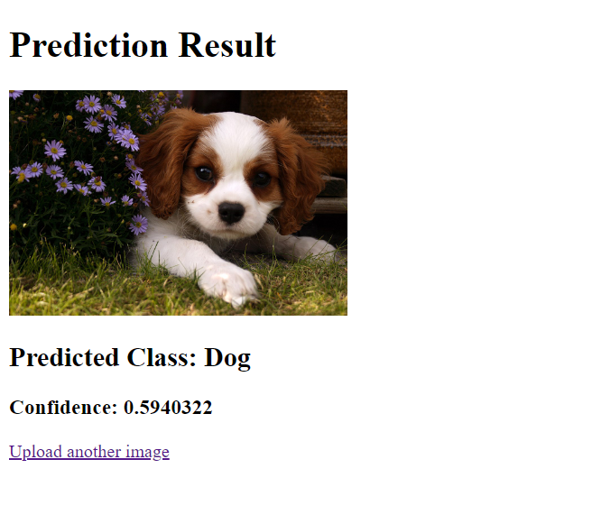

# Dockerized Classifier Web App

This project is a simple Flask web application that uses a pre-trained ResNet50 model to classify images of cats and dogs. The primary purpose of this project is to explore Docker and containerize a Flask application.

## Project Structure

├── .dockerignore
├── .gitignore 
├── Dockerfile 
├── classifier.py # python script that uses a pre-trained ResNet50 model to classify images of cats and dogs 
├── predict.py # Main Flask app script 
├── requirements.txt # Python dependencies 
├── static # Directory where uploaded images are stored 
├── templates # HTML templates for the web interface
   │ ├── upload.html 
   │ └── result.html


## Features

- **Image Upload:** Users can upload an image through the web interface.
- **Image Classification:** The app uses a ResNet50 model to classify the uploaded image as either a cat or a dog.
- **Dockerized Application:** The entire app is containerized using Docker, making it easy to run in any environment.

## Requirements

- **Docker:** Ensure Docker is installed on your system.
- **Python 3.9** (for local development, if necessary).

## How to Run the Project

### Step 1: Clone the repository

```bash
git clone https://github.com/your-username/dockerized-classifier-web-app.git
cd dockerized-classifier-web-app

### Step 2: Build the Docker image

```bash
docker build -t flask-tensorflow-app .

### Step 3: Run the Docker container

```bash
docker run -p 5000:5000 flask-tensorflow-app

### Step 4: Access the Application

Open your web browser and navigate to [http://localhost:5000](http://localhost:5000). You can upload an image to see the predicted class and confidence score.

### Key Files

- **predict.py:** Contains the main Flask app and the TensorFlow model code for image classification.
- **Dockerfile:** Defines the Docker container environment, installs dependencies, and sets up the Flask app.
- **requirements.txt:** Lists all Python packages required for the project, such as TensorFlow, Flask, and OpenCV.
- **upload.html:** Front-end interface for uploading an image.
   
- **result.html:** Displays the classification result and the uploaded image.
   

### Conclusion

This project serves as a practical demonstration of using Docker to containerize a simple Flask web app that performs image classification using TensorFlow and OpenCV. While the web app itself is basic, the focus was on learning and experimenting with Docker.

